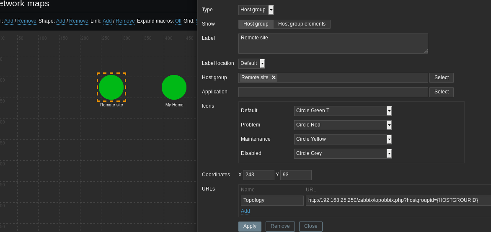
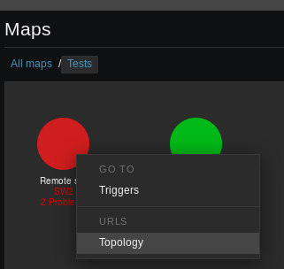

# Topobbix

Topobbix is a simple PHP script that generates a network topology based on the dependencies between the triggers of a given host group.

## Getting Started

These instructions will enable you to use the PHP script in your Zabbix environment.

### Prerequisites

Currently the script works only in Zabbix environments that use the MySQL or PostgreSQL database.

The HTML code generated by the PHP script references an external javascript library. If your Zabbix Frontend does not have internet access, you should make a local copy of the javascript library and change the reference in the PHP script.

### Installing

Copy the PHP script to the document root of your Zabbix frontend.
For example, if you use CentOS 7, the document root directory is located in "/usr/share/zabbix".

### Usage

The PHP script accepts two parameters:
* "hostgroup": Required. Defines which hostgroup in your Zabbix environment will be queried.
* "triggernames": Optional. If the value is "1" the names of the triggers will be displayed in the topology.

With the PHP script copied to the document root of your Zabbix Frontend, access it through the URL of your Zabbix:
* "https://localhost/topobbix.php?hostgroup=Region1"
The topology will appear in the browser:

If you add the triggernames parameter the topology will display the triggers name:
* "https://localhost/topobbix.php?Hostgroup=Region1&triggernames=1"

If the topology hosts have more than one dependency configured between them, more than one link between the hosts will be displayed when using the "triggernames = 1":

The colors of the triggers' severities are acquired from the Zabbix configuration. When any topology host contains active problems, its color will be changed to the most severe among active issues:

## Built With

* [MermaidJS](https://mermaidjs.github.io/) - A simple markdown-like script language for generating charts from text via javascript.

## Authors

* **Thiago Diniz** - [LinkedIn](https://www.linkedin.com/in/thiagomdiniz/)
